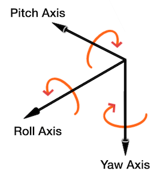

# ICSC22_Controller

This package contains the Arduino code necessary to get the ICSC controller to communicate with the host machine as well as some Csound examples.

## Requirements

In order to edit the example Arduino code you will need to first install the latest [Arduino IDE](https://www.arduino.cc/en/software).

After this you will need to install the ESP8266 NodeMCU board into your boards library.  
This can be done in the Arduino IDE by going to **File > Preferences** and in the additonal boards field enter the following URL:

```bash
http://arduino.esp8266.com/stable/package_esp8266com_index.json
```

The following libraries are also used in the example Arduino code:  
* [Wire](https://www.arduino.cc/reference/en/language/functions/communication/wire/)  
* [ESP8266](https://github.com/esp8266/Arduino)  
* [OSC](https://github.com/CNMAT/OSC) 
* [Smoothed](https://github.com/MattFryer/Smoothed)  

All of which can be added in the IDE via **Sketch > Include Library > Manage Libraries**

## Basic Usage

Even if you do not wish to edit the existing Arduino code, in order for your controller to communicate with a host machine you will need to change lines 18 and 19 of the example code to your SSID and network password.  
Note that both the controller device and the host machine need to be on the same network for communication to take place. 

```c
char ssid[] = "NetworkName";    // your network SSID (name)
char pass[] = "Password";  // your network password
```
The final change you will need to make is to ensure that the controller is sending data to correct IP address.  

You will need to change the address on line 22 to the address of the host machine. 
You may also wish to change the port number on line 23 (by default it is set to port 9000).

```c
const IPAddress destIp(192, 168, 123, 123);  // remote IP of the target device
const unsigned int destPort = 9000;          // remote port of the target device where the NodeMCU sends OSC to
```

Once you have successfully connected the controller to your network (the on-board LED will stop blinking and become a slightly dimmer, solid blue when connected succesfully) you are ready to send data to the target device.  
As it stands, the controller will send data to the **/Node** handle and out of the box, the data is sent in the following order:
1. X-axis of the joystick
2. Y-axis of the joystick
3. Joystick switch
4. Yaw
5. Pitch
6. Roll
7. Rate of displacement of pitch
8. Rate of displacement of Roll
9. Direction of Pitch movement
10. Direction of Roll movement




The yaw, pitch and roll are caluclated using [S.J Remington's code](https://github.com/jremington/MPU-6050-Fusion/blob/main/MPU6050_gyro_only.ino) as this seems to provide the most stable readings from the MPU-6050.  


* Yaw readings are from 0 to 360
* Pitch readings are from -90 to 90
* Roll readings are from -180 to 180
* X and Y readings frome the Joystick are from 0 to 1023
* The button is simply a binary input


## Usage Examples
    

## License

GPL